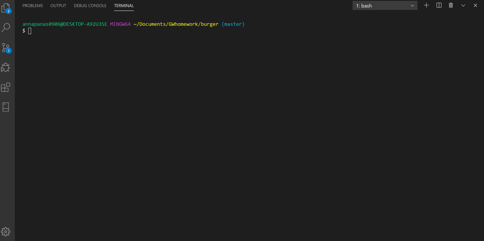

# burger

Eat-That-Burger! is a restaurant app that lets users input the names of burgers they'd like to eat. 

* HERE IS AN APP FLOW:

First users are prompted to put in a burger name into input field and click on a "submit" button. When "submit" button is cliked, burger name will  appear in "Not devoured" column. Each burger will have a "Devour" button right next to it and if it's cliked, that burger will be moved to "Devoured" column.

* TOOLS USED TO BUILD AN APP:

- jQuery
- Node JS
- Express
- MySQL
- Sequelize
- Handlebars
- Heroku

* STEPS I TOOK TO BUILD THIS APP:

1. Created all files and directories following the MVC design pattern 
2. Installed node packages : express, express-handlebars, mysql, mysql2, sequelize
3. Synced database with project following Sequelized-CLI guide
4. I used handlebars to generate HTML. Inside index.hadlebars file I built a home page, where user is prompted for a burger name input. I used bootstrap CSS grid and form components, CSS for design and cleaner UI. 
5. I set up a get route to render a home page in browser 
6. I build a front-end logic in cheeseburger.js file located in public folder using jQuery, where I selected DOM elements, added event listeners to all buttons and made ajax calls.
7. I set up routes in api_routes.js file for creating a new burger and adding it to database, finding all burgers in database and updating each burger if it's been devoured.
8. I used handlebars to dynamically populate "Not devoured" and "Devoured" lists. I run into an security issue with handlebars, when I was trying to traverse the data from database response, and I wasn't able to grab a burger's name, so in "Not devoured" list only a new button was getting generated when a "submit" button was cliked, but a name of a burger wouldn't get displayed. To solve that issue, I had to build a new object and populate it with the data handlebaars needs (Lines 48-52 of api_routes.js file).
9. When an app was fully functional locally, I deployed it to Heroku, even though I run into issue with adding a database at first. Here's a link of Heroku deployed application: https://infinite-ridge-31103.herokuapp.com/

